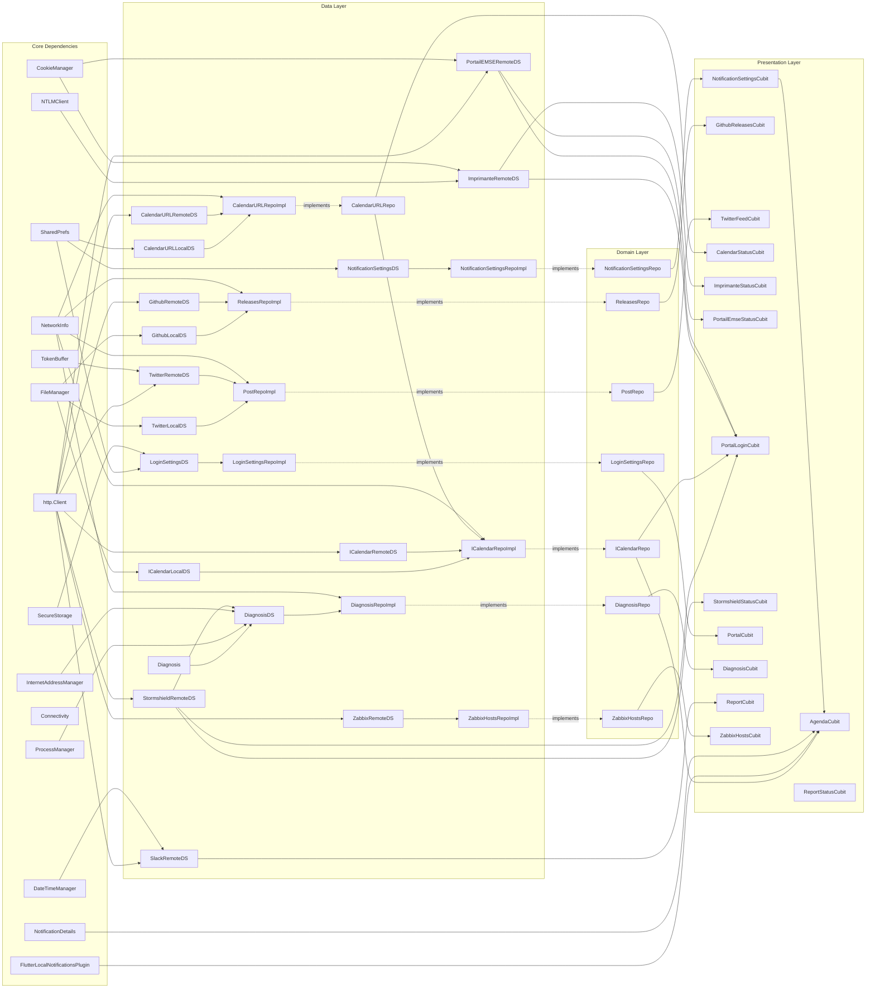

# Architecture Logicielle

[**Basé sur ResoCoder et son Architecture Clean.**](https://resocoder.com/flutter-clean-architecture-tdd/)

## Rappels sur Dart et Flutter

### Dart

Dart est un langage de programmation développé par Google pour des applications cross-platform.

Dart est un langage Orienté Objet basé sur les classes et avec ramasse-miettes.

### Flutter

Flutter est un SDK base sur Dart pour **UI** développé par Google pour des applications cross-platform.

Flutter est codé en C++ et utilise la libraire SKIA pour coder sur plusieurs moteurs de rendu (OpenGL ES, OpenGL, Vulkan et Meta).

Flutter compile directement en code native pour le Runtime de Flutter et bytecode D8 pour Android-spécifique.

Flutter fonctionne **uniquement** avec un arbre de **widgets**.

## Architecture Clean

### Description

L'architecture logicielle est Clean (avec un peu d'exceptions).

L'architecture Clean se repose sur la dépendances des données, l'inversion de contrôle et les trois couches d'architecture classique.


Les trois couches sont :

- La couche Data : Code IO (Networking, Cache, ...)
- La couche Domain : Code Métier (Usecases, Repositories, Entities)
- La couche Presentation : Code UI (Widgets, UI State Management, Router, ...)


Les remote data sources dépendent d'un client.

Les repositories dépendent des remote et local data sources.

Les usecases dépendent des repositories.

Les UI Logic Holders (Cubits ou BLoC dans ce projet) dépendent des usecases ou repositories.

L'UI dépendent des UI Logic Holders.

**La solution pour satisfaire ces dépendances est l'injection de dépendance via `get_it` et `injectable`.**

### Exemple dans un cas réel

#### Core

```dart
///
/// Core Layer
///

/// Global instance of get_it stored in `sl`
final GetIt sl = GetIt.instance;

@injectableInit
Future<void> init() async => $initGetIt(sl);

@module
abstract class ExternalsModule {
  /// Inject http.Client provided by the following function
  @lazySingleton
  http.Client get httpClient => io_client.IOClient(HttpClient()
    ..badCertificateCallback = // Do not check for HTTPS
        ((X509Certificate cert, String host, int port) => true));

  /// ... Other external dependencies injections
}
```

Comme nous allons avoir besoin d'un client HTTP en dépendance, nous ajoutons l'injection manuelle du client.

Normalement, nous aurions très bien pu écrire `http.Client get httpClient => http.Client()`, cependant, nous devons changer la configuration du client pour ignorer le certificat SSL. Par conséquent, la méthode `badCertificateCallback` retournera toujours `true` pour ignorer les certificats SSL.

Le module `ExternalsModule` set pour les injections de dépendances externes au projets comme par exemple les clients HTTP, SharedPreferences, les fichiers, ...

Le `@lazySingleton` fusionne deux patterns de programmation: `lazy` et `singleton`.

- `singleton` est assez similaire à une variable _globale_ ou _static_. La différence entre _static_/_global_ et un _singleton_ est le cycle de vie. Une variable _static/globale_ est instancié à la déclaration de la variable. Un singleton est instancié manuellement (via _initGetIt_ par exemple) et préférentiellement au démarrage de l'application, en runtime.

- `lazy` signifie "à l'appel" comparé à `eager` qui signifie "avant l'appel". `lazy` est du _Just-In-Time_ et `eager` est du _Ahead-Of-Time_. Dans le contexte d'injection de dépendance, cela signifie que l'on instancie une variable à l'appel et non à la déclaration.
- `lazySingleton` signifie alors "instanciation unique et uniquement au premier appel de la variable". Si la variable est rappelé, alors, la même instance est réutilisé.

Le `@lazySingleton` provient du paquet _Injectable_.

Il existe trois modes d'injections :

- `@injectable` : Utilise une nouvelle instance à chaque appel
- `@singleton` : Instancie au démarrage de l'application et réutilise cette instance à chaque appel
- `@lazySingleton` : Instancie au premier appel et réutilise cette instance à chaque appel

Pour choisir quel mode il faut choisir, il faut se poser la question "Quel cycle de vie ?".

Généralement, les singletons **sont déconseillés**, car leur cycle de vie est "globale" et l'application devient chargé.

Les lazy singletons sont à utiliser selon le cycle de vie. Si nous souhaitons pouvoir stocker l'état de la classe durant toute l'application (cache, cookies, ...), alors **lazySingleton** est surement un bon choix. Sinon, toute classe dites Stateless (sans états mutables) peuvent être des lazySingletons. Cependant, il faut garder en tête la gestion de la mémoire.

**En cas de doute, si stateless, mettre `@injectable`.** Dans le projet, pratiquement tout est `@lazySingleton`, mais comme il s'agit d'une petite application, cela suffit.

Les injectables sont à utiliser si la classe est réutilisé plusieurs fois, mais que l'état ne doit pas être stocké (en clair, une instanciation classique). Par exemple, les **UI Logic Holder** doivent être _injectable_, car, c'est mauvaise pratique de garder l'état d'une page en mémoire après l'avoir quitté.

**_Injectable_ signifie pouvoir se faire injecter des dépendances et s'injecter dans d'autre classe.**

#### Data Layer

```dart
///
/// Data Layer
///

/// A prototype for the remote data source
abstract class GithubRemoteDataSource {
  /// Fetch Releases from network
  Future<List<GithubRelease>> fetchReleases(String repo);
}

/// The implementation of the remote data source
@LazySingleton(as: GithubRemoteDataSource)
class GithubRemoteDataSource implements GithubRemoteDataSource {
  final http.Client client;

  // Dependency
  const GithubRemoteDataSource({required this.client});

  @override
  Future<List<GithubRelease>> fetchReleases(String repo) async {
    // ... Do
  }
}

/// Inject to the domain layer
@LazySingleton(as: ReleasesRepository)
class ReleasesRepositoryImpl implements ReleasesRepository {
  final GithubLocalDataSource localDataSource;
  final GithubRemoteDataSource remoteDataSource;
  final NetworkInfo networkInfo;

  /// Dependencies
  const ReleasesRepositoryImpl({
    required this.localDataSource,
    required this.remoteDataSource,
    required this.networkInfo,
  });

  @override
  Future<List<GithubRelease>> get(String repo) {
    // Do
    // ...
  }
}

```

Nous faisons une couche d'abstraction pour le documentation. Cependant, cela n'est pas obligatoire.

Ici, **`GithubRemoteDataSource`** dépend de `http.Client`.

En utilisant `@LazySingleton(as: GithubRemoteDataSource)`, la classe est dite _Injectable_ (annoté par _lazySingleton_, _singleton_ ou _injectable_). Ayant une dépendance elle-même _Injectable_, celle-ci se verra automatiquement instancié et passé en paramètre.

De même, toute présence de `GithubRemoteDataSource` en paramètre de classe _Injectable_ se verra injecté une instance de `GithubRemoteDataSource`.

Dans la couche Domain, il existe une couche d'abstraction. **Dans la couche Data, nous implémentons cette couche abstraite.**

Nous n'expliquerons pas **`async/await` et `Future`**, RTFM.

#### Domain Layer

```dart
///
/// Domain Layer
///

/// Entities
@freezed
class GithubRelease with _$GithubRelease {
  @JsonSerializable(explicitToJson: true)
  const factory GithubRelease({
    required String url,
    required String html_url,
    /// ... datas
  }) = _GithubRelease;

  factory GithubRelease.fromJson(Map<String, dynamic> json) =>
      _$GithubReleaseFromJson(json);
}

/// Repositories interfaces
abstract class ReleasesRepository {
  Future<List<GithubRelease>> get(String repo);
}
```

Ici, la couche d'abstraction est **vitale** pour une séparation propre des responsabilités.

La couche Domain ne contient que du code métier. Cela signifie **aucune dépendance aux outils d'interfaçage (HTTP, SQL, ...).** Par conséquent, le code est généralement en pure Dart.

C'est également dans cette couche que tout "cas d'utilisation" est implémenté. Ici par exemple, il s'agit uniquement de "Récupérer les releases sur Github". Si le cas d'utilisation était plus compliqué, par exemple "Récupérer les releases sur Github ordonnée par ordre alphabétique", il faudrait créer un classe de type Usecase (voir [cours de ResoCoder](https://resocoder.com/2019/08/29/flutter-tdd-clean-architecture-course-2-entities-use-cases/)).

`@freezed` est un moyen pour faire des data classes et des sealed classes. Voir [doc officielle de freezed](https://pub.dev/packages/freezed). Voir doc Kotlin sur la définition des [sealed classes](https://kotlinlang.org/docs/sealed-classes.html) et [data classes](https://kotlinlang.org/docs/data-classes.html).

#### Presentation Layer

```dart
///
/// Presentation Layer
///

/// UI Logic Holder
@injectable
class GithubReleasesCubit extends Cubit<GithubReleasesState> {
  final ReleasesRepository repository;

  GithubReleasesCubit({
    required this.repository,
  }) : super(const GithubReleasesState.initial());

  Future<void> getReleases(String repo) async {
    emit(const GithubReleasesState.loading());
    try {
      final releases = await repository.get(repo);
      emit(GithubReleasesState.loaded(releases));
    } on Exception catch (e) {
      emit(GithubReleasesState.error(e));
    }
  }
}

/// UI States
@freezed
class GithubReleasesState with _$GithubReleasesState {
  const factory GithubReleasesState.initial() = GithubReleasesStateInitial;
  const factory GithubReleasesState.loading() = GithubReleasesStateLoading;
  const factory GithubReleasesState.loaded(List<GithubRelease> releases) =
      GithubReleasesStateLoaded;
  const factory GithubReleasesState.error(Exception error) =
      GithubReleasesStateError;
}

/// UI
class GithubScreen extends StatelessWidget {
  const GithubScreen({Key? key}) : super(key: key);
  @override
  Widget build(BuildContext context) {
    return buildBody(context);
  }

  Widget buildBody(BuildContext context) {
    return BlocProvider(
      /// With get_it, inject the dependency GithubReleasesCubit
      /// and call getReleases.
      create: (_) =>
          sl<GithubReleasesCubit>()..getReleases((ApiKeys.githubRepo)),
      child: Center(
        /// Build the widget based on the UI State
        child: BlocBuilder<GithubReleasesCubit, GithubReleasesState>(
          builder: (BuildContext context, GithubReleasesState state) {
            return state.when(
              initial: () =>
                  const CircularProgressIndicator(key: Key(Keys.newsLoading)),
              loading: () =>
                  const CircularProgressIndicator(key: Key(Keys.newsLoading)),
              loaded: (releases) => GithubReleasesDisplay(releases: releases),
              error: (error) => ErrorDisplay(message: error.toString()),
            );
          },
        ),
      ),
    );
  }
}

/// Show the releases on a list
class GithubReleasesDisplay extends StatelessWidget {
  final List<GithubRelease> releases;

  const GithubReleasesDisplay({
    required this.releases,
    Key? key,
  }) : super(key: key);

  @override
  Widget build(BuildContext context) {
    return ListView.builder(
      padding: const EdgeInsets.all(10.0),
      key: const Key(Keys.githubList),
      itemCount: releases.length,
      itemBuilder: (BuildContext context, int index) => GithubCard(
        release: releases[index],
        key: Key(Keys.githubItem(index)),
      ),
    );
  }
}
```

Voir [Cubit](https://pub.dev/packages/bloc) et [Flutter Cubit](https://pub.dev/packages/flutter_bloc). Nous n'allons pas expliquer **Stream/Observable/Rx**, RTFM.

En résumé, **Cubit est un gestionnaire d'état observable.** Un Cubit reçoit un flux d'évènement (`click button`, `load page`, ...) et en résulte en un état (`data fetched`, `page loaded`, `loading`, ...). Un cubit **remplace un StatefulWidget**. C'est-à-dire que dans ce projet, **setState** n'est pas utilisé.

Un cubit est également une solution pour faire une machine d'état finie asynchrone sans se compliquer la vie.

Nous utilisons un `BlocBuilder` pour afficher des widgets selon les états. Il existe d'autres observateurs comme le classique `.stream.listen(onData)` qui est l'observateur de Dart.

## Graphe des dépendances

29-03-2021


